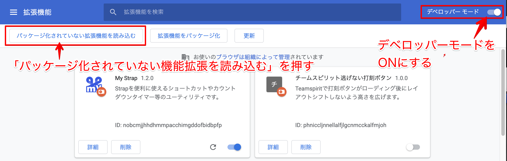
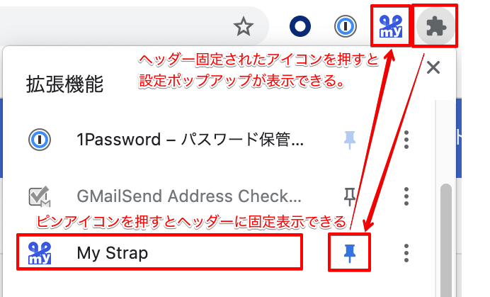
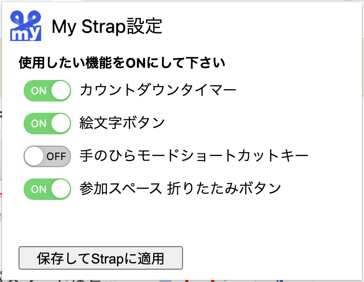
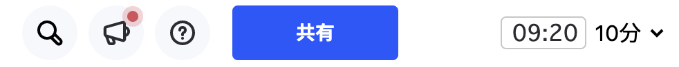
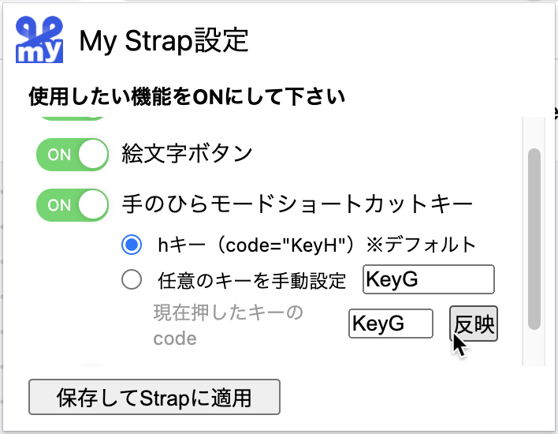
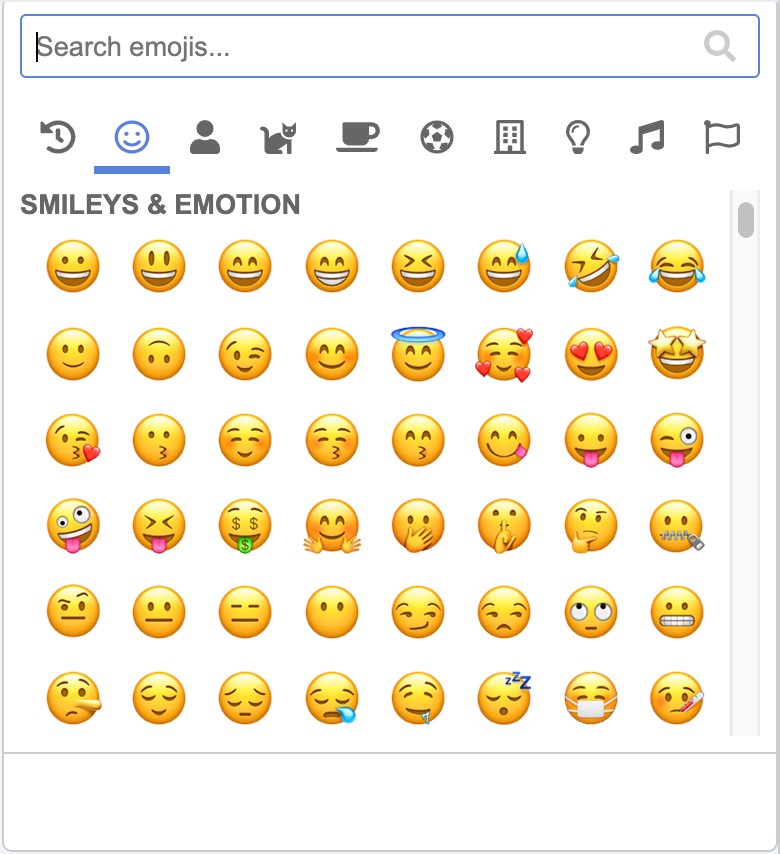
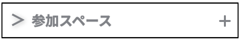

# my-strap

This is a Chrome extension for using the online whiteboard "[Strap](https://product.strap.app/)" conveniently.

---

オンラインホワイトボード [Strap](https://product.strap.app/) がより使いやすくなるChrome 機能拡張です。  
日々MTGや情報整理・構造化、コミュニケーションをStrapで行う上で、こうだったらもっと便利になりそうというアイデアを自分用に開発しています。  
（この機能拡張はStrap非公式のツールです。個人が趣味で開発したことをご理解の上ご利用ください）  

## Install

1. [my-strap-for-chrome-extension.zip](./my-strap-for-chrome-extension.zip) をダウンロードして、zipを解凍する。（chrome ウェブストアには未公開中）
2. Google chrome で新規windowにて [chrome://extensions/](chrome://extensions/) を開く。
   blockされる場合は `chrome://extensions/` をコピー&ペーストしてURL欄に直接入力する。
3. 機能拡張画面が開いたら「デベロッパーモード」のスイッチをONにする。
4. 「パッケージ化されていない機能拡張を読み込む」ボタンを押す。
5. ファイル選択ダイアログが開くのでzip解凍した「my-strap-for-chrome-extension」フォルダを選択し「選択」ボタンを押す。
6. 機能拡張画面に「My Strap」が表示されているか確認する。
7. Chromeヘッダーのパズルピースっぽいアイコン（機能拡張アイコン）をクリックする。
8. 機能拡張一覧が開くので「My Strap」右のピンボタンを押す。するとヘッダーにMy Strapアイコンが表示される。
9. ヘッダーのMy StrapアイコンをクリックすることでMy Strap設定ポップアップを開けるようになる。
10. My Strap設定ポップアップには機能毎にスイッチがある。使いたい機能をONにして「保存してStrapに適用」ボタンを押すと各機能が使えるようになる。

**機能拡張画面**

  

**ChromeヘッダーにMy Strapアイコンをピン留め**

  

**My Strap設定ポップアップ**

  

---

## Usage

### カウントダウンタイマー

1. 「timer」セレクトボックスを選択すると10秒〜30分の選択肢が表示される。
2. 任意の時間を選択すると左側のテキストフォーム欄に時間が表示される。
3. 10秒以下になると赤く点滅して残り時間わずかの警告が表示される。
4. カウントダウン中でもセレクトボックスから任意の時間を選択することで時間変更が可能。

### 手のひらモードショートカット設定

1. デフォルトでは「h」キーを押す度に手のひらモードのON・OFFが入れ替わる。
2. 付箋やカードでテキスト編集時（contenteditable = true）の時は動作しない。
3. ショートカットキーを「h」以外にしたい場合は、Chromeのヘッダーにある「My Strap」アイコンを押すか、またはChrome機能拡張一覧モーダルから「My Strap」を選択する。
4. すると「My Strap設定」ポップアップが開くます。ここで「手のひらモードショートカットキー」のスイッチをONにする。
5. ショートカットキーは以下2つから選択できる。
   - デフォルト「h」キー
   - 任意のキーを手動設定
     - キーボードの「code」を設定する。
     - 任意のキーを押すとリアルタイムで押したキーの「code」が「現在押したキーのcode」欄に表示される。その後「反映」ボタンを押すと、「任意のキーを手動設定」欄に入力される。
     -   
6. 設定が終わったら保存ボタンを押す、
7. 保存したらStrapを再読み込みすると設定内容が反映される。

### 絵文字ピッカー

1. Strapのボード画面右上の「絵」アイコンを押すと絵文字一覧が表示される。
2. ここから任意の絵文字をクリックすることでクリップボードにコピーされる。
3. Strapアイコンとは異なりただの文字扱いなので、バウンディングボックスでの拡大縮小や輪郭のみ表示はされない。
4. 図形やテキストモードにしてペーストして使用する。

### 参加スペースメニューの折りたたみボタン

1. Strapのスペース画面右「参加スペース」項目に矢印ボタン（＞）が表示される。
2. ここをクリックすることで参加スペース一覧の表示非表示がトグル式に切り替わる。
3. 操作結果はChrome機能拡張内部で記憶されるので、他スペースやボード遷移、ブラウザ更新しても同じ状態をキープする。（※ページロード完了から表示切り替えまで数秒のタイムラグあり）

